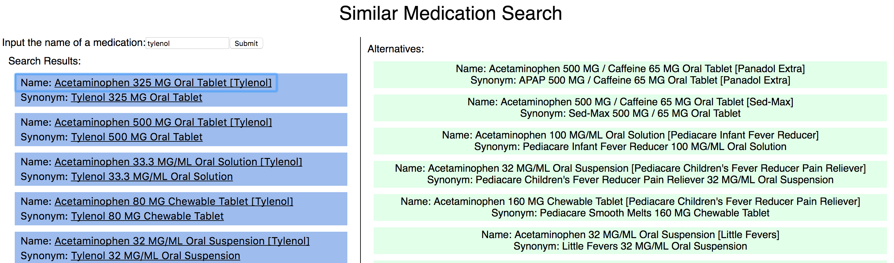

# similarMedicationSearch
Enable users to find all generic and branded drugs that contain the same active ingredients as a reference drug. 

# To view:
Visit [similar-meds.herokuapp.com](https://similar-meds.herokuapp.com/) to see the deployed application.

# To run locally:
```
$ git clone https://github.com/jdlawrence/similarMedicationSearch.git
$ cd similarMedicationSearch
$ npm install
```

From here you can run in dev mode with webpack-dev-server (and hot reloading) or in production mode.

### To run with webpack-dev-server:
You will need to run two servers, one for the client, and one for the api server.
This is most easily accomplished with two terminal windows.

In the root directory:

```
$ npm run start-dev
```

From within the root directory, in a separate tab in your terminal 

```
$ cd client
$ npm install
$ npm run start
```


### To run in production mode
In the root directory run: 

```
$ npm run start-dev
```
### Further Information:
This utlizes the [RxNorm API](https://rxnav.nlm.nih.gov/RxNormAPIREST.html#label:functions). Here's a screenshot of what it looks like:

